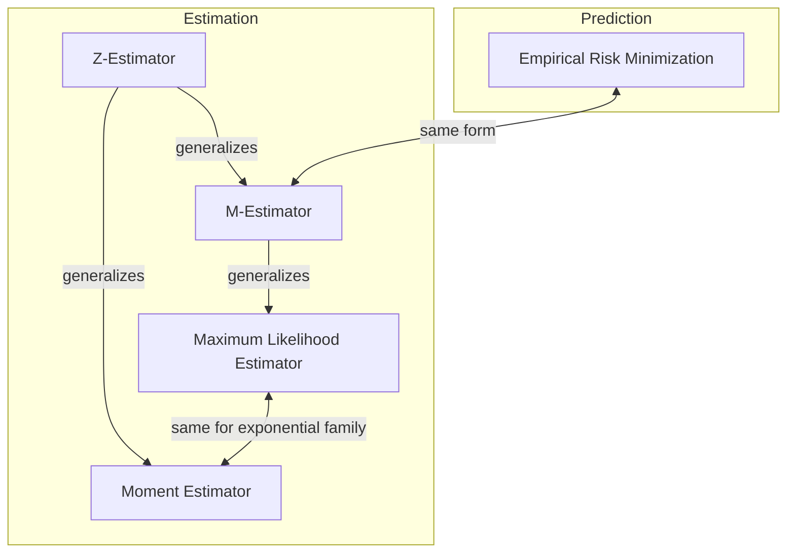

---
{"publish":true,"created":"2023-08-02T18:42:38","modified":"2025-06-06T04:14:52","cssclasses":"","type":"note","sup":["[[Machine Learning]]","[[Statistics]]"],"state":"done"}
---

# Estimation

- Types of estimation
    * [[Estimation#Point Estimation]]
    * [[Confidence Interval]]/Region
    * [[Bayes Estimator]]
* Metric
    * [[Evaluating an Estimator]]
- Methods
    * [[Method of Moments]]
    * [[Maximum Likelihood Estimation]]
    * [[Mean Squared Error\|Least Squares]]
    * [[M-Estimator]]

> [!rmk] Comparison of Estimation Methods  
> * For quadratic risks, [[Maximum Likelihood Estimation\|MLE]] is more accurate in general
> * [[Maximum Likelihood Estimation#Misspecification\|MLE]] still gives good results even for misspecified models, while [[Method of Moments]] is more sensitive to model misspecification.
> * Sometimes [[Maximum Likelihood Estimation\|MLE]] can be computationally intractable, and [[Method of Moments]] is easier with only polynomial equations.

This note focuses on point estimation.

## Point Estimation

A **==point estimator/statistic==** is just a "prediction" of some quantity of interest based on some data points. The quantity of interest can be a single parameter, a vector of parameters, or even a whole function.

By convention, a point estimate of $\theta$ is denoted by $\hat{\theta}$. And it's of the following form:
$$\hat{\theta}_m = g(x^{(1)},\dots,x^{(m)})$$

Where $x^{(i)}$ are data points and $g$ can be any valid function, thus the range of $g$ is the same as the set of allowable values of $\theta$.

Besides parameters, we can also predict functions directly, and such point estimations are called **==function estimations==**. The function estimator $\hat{f}$ is simply a point estimator in function space.
