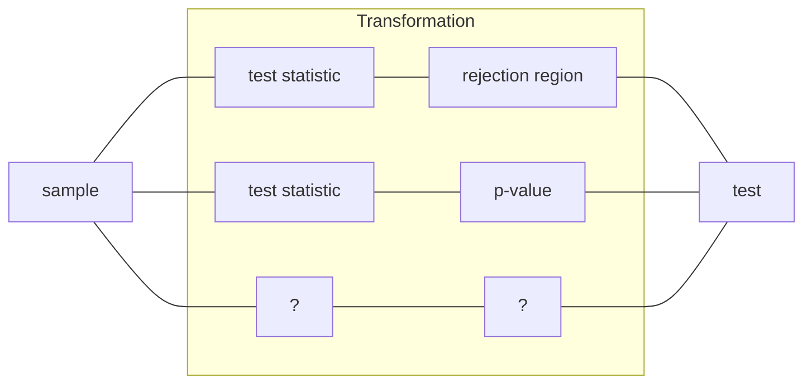

---
{"publish":true,"title":"Hypothesis Testing","created":"2022-12-07T20:11:12","modified":"2025-06-04T19:30:40","cssclasses":"","type":"note","sup":["[[Statistics]]"],"state":"done"}
---

# Hypothesis Testing

> [!tldr]- Takeaway Card
>
> - Numerous concepts around hypothesis testing (HT) can be confusing. Always locate yourself in the general **[[Statistical Decision Theory\|statistical binary decision-making]]** framework.
> - Under this framework, the question asked for the task is "[[Hypothesis Testing#how to evaluate a test]]?" All different metrics stem from the two basic ones: Type I error and Type II error. See also the [[Evaluating a Test#^confusion\|confusion matrix]] of an HT. Remember that your evaluation can always balance the two errors, or focus on one of them.
> - The question asked for the algorithm is "[[Hypothesis Testing#how to construct a test]]?" This statistical procedure is simply a *transformation* of the sample into a binary decision rule. One transformation path is through [[Hypothesis Testing#test statistic and rejection region]]. Another path is through test statistic and [[p-value]].
> - HT focuses on *disproving* the null hypothesis, resulting in an *asymmetry* between the null and alternative hypotheses. Calculating the Type I error, test statistic (under the null), and p-value only requires the null hypothesis. However, the [[Hypothesis Testing#Role of Alternative\|alternative hypothesis plays a role]] in shaping the belief about the complement of the null and dictating the direction of extremeness.

Hypothesis testing (HT) is a classical [[Statistical Decision Theory\|statistical decision-making]] problem, and can be extended to more general binary statistical decision-making problems. Given sample $X$, we need to make a decision $A(X)$ such that $A(X) \approx \mathbb{1}_{H_{1}}$, where $H_{1}$ is the alternative hypothesis.
In the context of HT, the statistical procedure $A$ is often called a ==test==, and denoted as $\psi(X)$. A test is a [[Statistic]].

Formally, given a [[Statistical Model]] $\{ P_{\theta} \}_{\theta\in\Theta }$, we want to test the following hypotheses:
$$
\begin{cases}
H_{0}: \theta \in \Theta _{0}, & \text{(null hypothesis)}\\
H_{1}: \theta \in \Theta_{1}, & \text{(alternative hypothesis)}
\end{cases}
$$
where $\Theta_{0}$ and $\Theta_{1}$ are disjoint subsets of $\Theta$.

## Basic Concepts

- Asymmetry in $H_{0}$ and $H_{1}$: the data is only used to try to disprove $H_{0}$. The result of an HT is either to **reject** or **fail to reject** the null hypothesis $H_{0}$. ^d85be2
- If $\Theta_{0} \cup \Theta_{1} = \Theta$, then we say we test $H_{0}$ against $H_{1}$. In this case, rejecting $H_{0}$ implies acceptance of $H_{1}$.
- Failing to reject $H_{0}$ never implies acceptance of $H_{0}$, but only that we do not have enough evidence to reject it.
- When $\Theta_{0}$ and $\Theta_{1}$ are singletons, we call it a ==simple-simple== HT. Otherwise, we call it a ==composite== HT.
- Suppose $\Theta_{0} = \{ \theta_{0} \}$ and $\theta_{0}\in\R$. Then the HT is ==two-sided== if $H_{1} : \theta\ne\theta_{0}$, or is ==one-sided== if $H_{1} : \theta < \theta_{0}$ or $H_{1} : \theta > \theta_{0}$.

## How to Evaluate a Test

We now focus on the test, i.e., the statistical procedure/algorithm/policy $\psi$ for an HT. The first question is

- [?] What is a good/optimal test?

Please refer to [[Evaluating a Test]] for some answers.

## How to Construct a Test

Once we determine the evaluation criteria for a test, the next question is

- [?] How to construct a test $\psi$ that satisfies the criteria?

In this note, we focus on constructing tests that achieve a certain significance level $\alpha$.

Simple constructions directly map the sample to a decision rule, for example: after tossing a coin 4 times, we decide the coin is biased (towards heads) if the number of heads is greater than 2.

More sophisticated and principled methods are needed. In response, some transformations of the sample (statistics) are introduced to construct the test. We discuss two examples:

- [[Hypothesis Testing#Test Statistic and Rejection Region]]. A test statistic is a statistic of the sample usually with a known distribution **under the null hypothesis**. Then the critical values form a rejection region for the test statistic. The test is then based on whether the test statistic falls into the rejection region.
- [[Hypothesis Testing#p-value]]. Sometimes critical values are not available, or the rejection region is not easy to construct. The use of p-value eliminates the need for rejection regions. p-value is a statistic of the test statistic (which is a random variable). The test is then based on whether the p-value is smaller than the level $\alpha$.
    - If we treat p-value as the test statistic, we can see that it gives a principled way of constructing rejection regions: $\mathrm{RR} = \{ p \le \alpha \}$, without the need for other critical values.

## Test Statistic and Rejection Region

For a hypothesis and sample $\{ x_{i} \}$, we construct a ==rejection region== of the following form:
$$
\mathrm{RR} = \{ x_{1},\dots,x_n \mid t \ge c \},
$$
where $t$ is called the ==test statistic==, and $c$ is called the ==critical value==.
If $\{ x_{i} \} \in \mathrm{RR}$ , we **reject** the hypothesis.

See [[Hypothesis Testing#CLT Test Statistic]] for an example of a test statistic.

### Rejection Region by Confidence Interval

There is a [[Confidence Interval and Hypothesis Test Duality\|duality between confidence interval and hypothesis tests]].
Suppose we have a level $(1-\alpha)$ [[Confidence Interval]] for $\theta$ given by $[l(\boldsymbol{x}), u(\boldsymbol{x})]$. Then the rule "reject $\mathrm{H}_0: \theta=\theta_{0}$ if $\theta_0 \notin[l(\boldsymbol{x}), u(\boldsymbol{x})]$" has a significance level $\alpha$:
$$
P_{\theta_{0}}(\psi(X)=1) = P_{\theta_{0}}\left( [l(X),u(X)]\not\ni\theta_{0}  \right) = \alpha.
$$
Therefore, a rejection region can be constructed by the complement of the confidence interval.
See [[Confidence Interval and Hypothesis Test Duality]] for constructing CIs from HTs.

### Rejection Region by Likelihood Ratio

 

## Rejection Region

We can also construct a rejection region using the [[Likelihood]] ratio:
$$
\Lambda(\boldsymbol{x}) = \frac{\sup_{\theta \in \Theta_0} L(\theta \mid \boldsymbol{x})}{\sup_{\theta \in \Theta} L(\theta \mid \boldsymbol{x})}
= \frac{L(\hat{\theta}_{0} )}{L(\hat{\theta}_{\mathrm{MLE}})},
$$
where $\Theta_0$ is the null hypothesis parameter space.
Then, the rejection region is given by
$$
\mathrm{RR} = \{ \boldsymbol{x} \mid \Lambda(\boldsymbol{x}) \le k \},
$$
where $k$ is chosen such that the test has a significance level $\alpha$.

This method is called the ==likelihood ratio test==.

 <a href="Likelihood Ratio Test" class="internal transclude-src">Link to original</a>

## CLT Test Statistic

Similar to [[Confidence Interval#CLT CI]], [[Central Limit Theorem\|CLT]] is also often used to construct a test statistic, and then the [[Hypothesis Testing#p-value]], especially for HTs about the mean.

- [*] Recall that a test statistic, or the HT itself, is to disprove null. Thus, a test statistic is often constructed as a function of $\theta_{0}$.

Suppose we want to test the null about mean $H_{0}: \theta=\theta_{0}$. Assuming null, CLT gives
$$
\frac{\theta- \theta_{0}}{\operatorname{SE}(\theta )} \overset{d}{\longrightarrow} \mathcal{N}(0,1).
$$

- [*] Different from the [[Confidence Interval#Wald CI\|Plug-in CI]], we do not need to estimate the standard error using estimated $\theta$. Instead, we use the known $\theta_{0}$ to calculate the standard error.

More concretely, suppose the sample is $n$ iid Bernoulli r.v.s. Then the test statistic is
$$
T_n = \sqrt{ n } \frac{\overline{X} - \theta_{0}}{\sqrt{ \theta_{0}(1-\theta_{0}) }}.
$$
And the rejection region for a $\alpha$-level test is
$$
\mathrm{RR} = \begin{cases}
T_n \ge z_{1-\alpha} && \text{ (right-tail test)},\\
T_n \le z_{\alpha} &&\text{ (left-tail test)},\\
|T_n| \ge z_{\alpha /2} &&\text{ (two-sided test)},
\end{cases}
$$
where $z_{\beta}$ is the $\beta$-quantile of the standard normal distribution.

## p-Value

 

## Introduction

**p-value** is the probability of obtaining a real-valued **test statistic** *at least as* extreme as the one actually obtained under the **null hypothesis**. 
In other words, (asymptotic) p-value of a test is the smallest (asymptotic) level $\alpha$ at which the test rejects $H_{0}$. 
Consider an observed test-statistic $t$ from unknown distribution $T$. Then the p-value $p$ is what the prior probability would be of observing a test-statistic value at least as "extreme" as $t$ if null hypothesis $H_{0}$ were true. That is:

- $p=\Pr(T≥t|H_0)$ for a one-sided right-tail test,
- $p=\Pr(T≤t|H_0)$ for a one-sided left-tail test,
- $p=2\min\{\Pr(T\geq t\mid H_{0}),\Pr(T\leq t\mid H_{0})$ for a two-sided test.
    - If the distribution of $T$ is symmetric about zero, then $p=\Pr(|T|\geq |t|\mid H_{0})$

> [!ex] [[Hypothesis Testing#CLT Test Statistic]]
>
> $
> p =
> \begin{cases}
> \Pr\left(T_{n}\geq t\right) & \text{(right-tail test)}\\
> \Pr\left(T_{n}\leq t\right) & \text{(left-tail test)}\\
> \Pr\left(\left|T_{n}\right|\geq |t|\right) & \text{(two-sided test)}
> \end{cases}
> $
> where $t$ is the observed test statistic.

- [!] Since the test statistic is random, p-value is also random.

> [!thm] Fundamental rule of statistics
> $\text{Reject } \mathrm{H}_{0} \iff  p\text{-value} < \alpha$

In other words, an almost impossible event ($p<\alpha$) happens given H0, thus it is rejected.

- [~] The smaller the p-value, the more confidently one can reject $H_{0}$, because the event is too unlikely to happen under null.

 

# Exponential Family

A family of univariate [[Probability Density Function\|PDF]]/[[Probability Mass Function\|PMF]] is said to be **exponential** if it can be expressed as:
$$
f(x ; \theta)=c(\theta) h(x) e^{t(x) q(\theta)}
$$

^exp-pdf

where $c(\theta) \geq 0, h(x) \geq 0$.
A joint [[Probability Density Function\|PDF]] for a multivariate distribution is called exponential if
$$
f(x ; \theta)=c(\theta) h(\boldsymbol{x}) e^{\sum_{j=1}^k t_j(\boldsymbol{x}) q_j(\theta)}
$$
If $\theta\in\R^{k}$, such distribution is said to be in a $k$-parameter exponential family.

- $c(\theta)$ is the **normalizing constant**.
- $h(x)$ is the **base measure**.
- $\exp(q(\theta)^Tt(x))$ is the **exponential tilt** that up(down)-weights the base measure.
- $t(x)$ is a **sufficient statistic** w.r.t. the *natural* parameter space
  $$
  \Theta= \left\{  \theta:\int h(x)e^{q(\theta)^Tt(x)} \d x < \infty \right\}.
  $$

To verify if some family of distributions is of exponential type, we must be able to identify the functions $c(\theta), h(x), t(x)$ and $q(\theta)$.

Examples:

- [[Bernoulli Distribution]]: $f(x;p) = (1-p)e^{x \log \frac{p}{1-p}}$
- [[Binomial Distribution]]: $f(x;n,p) = {n \choose x}p^{x}(1-p)^{n-x}$
- [[Poisson Distribution]]: $p(n;\lambda) = e ^{-\lambda }(n!)^{-1}e^{n \log \lambda}$
- [[Normal Distribution]]: $(2\pi)^{-n /2} \sigma ^{-n}e^{n \mu^{2}}e^{-\left( \sum x _i^{2} - 2\left( \sum x_{i} \right)\mu \right) / \sigma^{2}}$
- [[Exponential Distribution]]

## MLE for Exponential Family

Due to exponential family's special form of the likelihood, the [[Maximum Likelihood Estimation\|MLE]] estimator of $\theta$ enjoys nice properties. Suppose $q(\theta)=\theta\in\R^{k}$.
We first note that the inverse normalizing constant is infinitely differentiable:
$$
\frac{ \partial ^{p} }{ \partial ^{j_{1}}\theta_{1} \dots \partial ^{j_{k}}\theta_{k} } \left( \frac{1}{c(\theta)} \right) =\int h(x)t_{1}^{j_{1}}(x) \dots t_{k}^{j_{k}}(x)e^{\theta^{T}t(x)} \d x,
$$
where $j_{i}\in\N$ and $p=\sum j_{i}$.
Therefore, the derivative of the log-likelihood $\operatorname{LL}(\theta \given x)$ is
$$
\begin{aligned}
\operatorname{LL}'(\theta) =& \frac{ \mathrm{d} }{ \mathrm{d}\theta } \left( \log \left(c(\theta)h(x)e^{\theta ^Tt(x)} \right) \right ) \\
=& \frac{c'(\theta)}{c(\theta)} + t(x) = -c(\theta)\frac{ \mathrm{d} }{ \mathrm{d}\theta }\left( \frac{1}{c(\theta)} \right)  + t(x)\\
=& t(x) - \int c(\theta)h(x)t(x)e^{\theta ^Tt(x)} \d x\\
=& t(x) - \mathbb{E}_{\theta}[t(X)].
\end{aligned}
$$
Then, the MLE estimator of $t$, which is the zero of the derivative, satisfies $\mathbb{E}_{\hat{\theta}_{\mathrm{MLE}}}t(X) = t(x)$, indicating that MLE is a [[Method of Moments\|moment estimator]].

 <a href="Exponential Family" class="internal transclude-src">Link to original</a>

 <a href="p-value" class="internal transclude-src">Link to original</a>

## Role of Alternative

Recall that 
 

- Asymmetry in $H_{0}$ and $H_{1}$: the data is only used to try to disprove $H_{0}$. The result of an HT is either to **reject** or **fail to reject** the null hypothesis $H_{0}$. 

 <a href="Hypothesis Testing" class="internal transclude-src">Link to original</a>

Also notice that in the calculation of the test statistic, critical value, and p-value, we only need the null hypothesis $H_{0}$. This brings up the question:

> [!qn] what is the role of the alternative hypothesis $H_{1}$?

We first remark that we do not expect the alternative to have the same critical role as the null, due to the asymmetry. However, the alternative do have two important implications:

- The alternative shapes the belief about the complement of the null. Specifically, the set pair $(\Theta_{0},\Theta_{1})$ forms a *model assumption*, meaning that we believe the true parameter is either in $\Theta_{0}$ or $\Theta_{1}$. Under this belief, when rejecting $H_{0}$, we implicitly accept $H_{1}$.
    - [@] For example, a company want to test their current risk control threshold $\theta_{0}$. Their hypotheses are $H_{0}: \theta = \theta_{0}$ and $H_{1}: \theta > \theta_{0}$. We can see that, they only reject the null if they *believe the risk is higher* then their current threshold. They do not modify the threshold (reject the null) even observing a risk significantly lower than the threshold, as it does no harm.
- The alternative dictates the direction of extremeness. When calculating the rejection region or p-value, it's important to know what counts as an *extreme* event under the null. The alternative dictates the direction, i.e., right-tail, left-tail, or two-sided.
    - [@] For example, suppose $H_{0}: \text{mean} = \mu_{0}$ and $H_{1} : \text{mean} = \mu_{1}$. Then, if $\mu_{1} > \mu_{0}$, it is extreme(ly unlikely the null is true) when we observe a large sample mean; on the other hand, if $\mu_{1} < \mu_{0}$, a small sample mean is extreme under the null.
