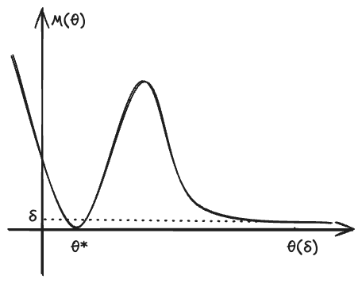

---
{"publish":true,"title":"M-Estimator","created":"2025-06-04T01:17:30","modified":"2025-06-10T23:10:03","cssclasses":"","state":"done","sup":["[[Estimation]]"],"alias":null,"type":"note","related":["[[Maximum Likelihood Estimation]]"]}
---

# M-Estimator

For an [[Estimation]] task, one can have different objectives (or metrics). For example, [[Maximum Likelihood Estimation\|MLE]] maximizes the likelihood of the estimator, [[Mean Squared Error\|Least Squares]] minimizes its squared error, and [[Ridge Regression]] minimizes the squared error with a penalty term.

M-estimators generalize the above ideas by using a general objective function
$$
m: \Theta \times \mathcal{X} \to \overline{\R}, (\theta,x)\mapsto m_{\theta}(x).
$$
Then, we can define the empirical error: $M_{n}(\theta)\coloneqq \hat{\mathbb{E}}_{n}m_{\theta }(X) = \frac{1}{n}\sum_{i=1}^{n}m_{\theta}(x_{i})$. And an ==M-Estimator== minimizes the empirical error:
$$
\hat{\theta} = \argmin_{\theta\in\Theta} M_{n}(\theta).
$$

- [~] We can see that M-estimators and [[Empirical Risk Minimization]] have the same formulation, one in the context of [[Estimation]] and the other in the context of [[Prediction]]/[[Supervised Learning]].

## Examples

We only need to specify the $m$ function to get different M-estimators.

- [[Maximum Likelihood Estimation]]: $m_{\theta}(x) = -\log p_{\theta}(x)$.
- [[Ordinary Least Squares]]: $m_{\theta}(x) = (y - x^T\theta)^2$.
- [[Ridge Regression]]: $m_{\theta}(x) = (y - x^T\theta)^2 + \lambda \|\theta\|^2$.
- Median regression: $m_{\theta}(x) = |y - x^T\theta|$.
- Quantile regression: $m_{\theta}(x) = -(\theta-x)(\tau - \mathbb{1}(\theta-x >0))$.
    - This loss is also known as the ==pinball loss==.

## Properties

In this section, we denote $M(\theta) \coloneqq \mathbb{E}_{P}m_{\theta}(X)$, and
$$
\theta ^{*} = \argmin_{\theta\in\Theta} M(\theta).
$$

### Consistency

By [[Law of Large Numbers\|LLN]], we know that
$$
M_n(\theta ) \overset{ P/\text{a.s.} }{ \to } M(\theta ), \quad \forall \theta.
$$
We wonder under what conditions the following is also true
$$
\hat{\theta} \coloneqq \argmin_{\theta\in\Theta} M_n(\theta) \overset{ P }{ \to } \argmin_{\theta\in\Theta} M(\theta) \eqqcolon \theta ^{*}.
$$
In the function graph of $M$ and $M_{n}$ (see e.g. [[M-Estimator#^fig-m-graph]]), the question ask what conditions allow to transfer the convergence of *y-axis* to that of *x-axis*.

It turns out that the above consistency holds under two reasonable conditions:

- **Uniform convergence**: $\sup_{\theta\in\Theta}|M_n(\theta)-M(\theta)|\overset{ P }{ \to }0$.
    - Some sufficient conditions for uniform convergence:
        - Finite [[Vapnik–Chervonenkis\|VC]] dimension.
        - Finite [[Rademacher Complexity]] or [[Gaussian Complexity]].
        - Compact $\Theta$ and continuous $M_{\theta}$ and $M$, and $\mathbb{E}_{P}[\sup_{\theta\in\Theta}M_{\theta}(X)] < \infty$.
- **Separation**: For any $\epsilon$, $\inf_{\theta:\|\theta-\theta ^{*}\| > \epsilon}M(\theta) > M(\theta ^{*})$
    - [~] In words, this condition says that only parameters close to $\theta ^*$ may yield a value of $M(\theta)$ close to the minimum $M(\theta ^*)$.

 ^fig-m-graph

#### Proof of Consistency

By the definition of $\hat{\theta}$, we have the critical inequality:
$$
M_{n}(\hat{\theta}) \le M_{n}(\theta ^{*}) \overset{ P }{ \to } M(\theta ^{*} ).
$$
Thus, we have
$$
M_{n}(\hat{\theta}) \le M(\theta ^*) + o_{P}(1). \tag{1}
$$
By the uniform convergence condition,
$$
\begin{aligned}
M(\hat{\theta})- M(\theta ^*) \le& M(\hat{\theta}) - (M_{n}(\hat{\theta}) - o_{P}(1))\\
\le& \sup_{\hat{\theta}\in\Theta}|M(\hat{\theta}) -M_{n}(\hat{\theta})| + o_{P}(1)\\
\overset{ P }{ \to }& 0.
\end{aligned}
$$
Then, since no other parameter can yield a value of $M(\theta)$ close to $M(\theta ^*)$ by the separation condition, we know $\hat{\theta}\overset{ P }{ \to }\theta ^*$. More specifically, for any $\epsilon>0$, we have
$$
\delta \coloneqq\inf_{\theta:\|\theta-\theta ^*\|>\epsilon} M(\theta) - M(\theta ^*) > 0.
$$
Then, since $M(\hat{\theta})-M(\theta ^*) \overset{ P }{ \to }0$, we know that $\|\hat{\theta}-\theta ^*\|\overset{ P }{ \le }\epsilon$. By the arbitrariness of $\epsilon$, we get the result.

#### Consistency of Approximate Estimator

As we can see in the proof, the crucial step is $(1)$. Therefore, we can replace $\hat{\theta}$ by any approximate estimator $\tilde{\theta}$ (approximate minimizer of $M_{n}$), and its consistent as long as $(1)$ holds, or equivalently,
$$
\begin{aligned}
& M_{n}(\tilde{\theta}) \le M_{n}(\hat{\theta}) + o_{P}(1) \\
\implies & M_{n}(\tilde{\theta})\le M(\theta ^*) + o_{P}(1).
\end{aligned}
$$

### Asymptotic Normality

Under some regularity conditions:

- $\theta \mapsto m_{\theta}(x)$ is differentiable at $\theta ^*$ $P$-a.s. (for almost every $x$);
- There exists an $L_{2}$ function $f$, such that $|m_{\theta_{1}}(x)-m_{\theta_{2}}(x)|\le f(x)\|\theta_{1}-\theta_{2}\|$ for all $\theta_{1},\theta_{2}$ in a neighborhood of $\theta ^*$;
- $e : \theta \mapsto \mathbb{E}m_{\theta}(X)$ is twice differentiable with a non-singular second derivative at $\theta ^*$, denoted as $V_{\theta ^*}=\ddot{e}_{\theta ^*}$;

we have
$$
\sqrt{ n }\left( \hat{\theta}-\theta ^* \right) \overset{ d }{ \to } \mathcal{N}(0,V_{\theta ^*}^{-1}\mathbb{E}[\dot{m}_{\theta ^*}\dot{m}_{\theta ^*}^T]V_{\theta ^*}^{-1}).
$$

- [!] Note that we do not require $m_{\theta}$ is twice differentiable. The twice differentiability of $e$ is weaker.

### Proof Sketch

In the proof sketch, we neglect the expectation, and assume that the expectation and derivatives commute. By Taylor expansion,
$$
M(\theta) - M(\theta ^*) \approx \dot{M}_{\theta ^*}^T(\theta - \theta ^*) + \frac{1}{2}(\theta - \theta ^*)^T\ddot{M}_{\theta ^*}(\theta - \theta ^*).
$$
Denote the RHS as $Q(\theta)$. Then, we have
$$
\hat{\theta} \approx \argmin_{\theta}M(\theta ) \approx \argmin_{\theta}Q(\theta).
$$
By setting
$$
\dot{Q}(\theta) = \dot{M}_{\theta ^*} + \ddot{M}_{\theta ^*}(\theta-\theta ^*) = 0,
$$
we get
$$
\hat{\theta} - \theta ^* \approx \ddot{M}_{\theta ^*}^{-1} \dot{M}_{\theta ^*}.
$$
Thus, the asymptotic variance is approximately
$$
\ddot{M}_{\theta ^*}^{-1}\dot{M}_{\theta ^*}\dot{M}_{\theta ^*}^T \ddot{M}_{\theta ^*}^{-1} = V_{\theta ^*}^{-1} \mathbb{E}[\dot{m}_{\theta ^*}\dot{m}_{\theta ^*}^T]V_{\theta ^*}^{-1}.
$$

#### Asymptotic Normality of Quantile Regression

Treating quantile regression as an M-estimator, we verify the above conditions and establish its asymptotic normality. Recall the pinball loss function:
$$
m_{\theta}(x) = -(\theta-x)(q - \mathbb{1}\{\theta-x >0\}).
$$

For the first condition, $\frac{ \partial  }{ \partial \theta }m_{\theta}(x)|_{\theta ^*}$ exists if $x\ne \theta ^*$. For any continuous distribution, $P(X=\theta ^*)=0$, so the first condition holds, and $\dot{m}_{\theta}(x) = -q+\mathbb{1}\{ \theta > x \}$.

The second condition also holds:
$$
\begin{aligned}
|m_{\theta_{1}}(x)-m_{\theta_{2}}(x)| &= \left| q(\theta_{2}-\theta_{1}) + (\theta_{1}-x) \mathbb{1}\{ \theta_{1}>x \} - (\theta_{2}-x)\mathbb{1}\{ \theta_{2} >x \}  \right| \\
&\le q\left| \theta_{2}-\theta_{1}| + |(\theta_{1}-x) \mathbb{1}\{ \theta_{1}>x \} - (\theta_{2}-x)\mathbb{1}\{ \theta_{2} >x \}  \right| \\
&\le q|\theta_{1}-\theta_{2}| + |\theta_{1}-\theta_{2}|\\
&= (q+1)|\theta_{1}-\theta_{2}|.
\end{aligned}
$$

For the third condition, we have
$$
\begin{aligned}
e(\theta) =&\int_{-\infty}^{\theta}  (1-q)(\theta-x) p(x)\d x -\int _{\theta}^{\infty}q (\theta-x)p(x)\d x\\
=& -q \theta + q \mathbb{E}[X] + \theta F(\theta ) - \int _{-\infty}^{\theta} xp(x)\d x
\end{aligned}
$$
By integration by parts,
$$
e(\theta ) = q(\theta-\mu) + \theta F(\theta ) - \left( xF(x)|^{\theta}_{-\infty} -\int _{-\infty}^{\theta}F(x)\d x \right) = q(\theta-\mu) +\int _{-\infty}^{\theta}F(x)\d x.
$$
Thus,
$$
\dot{e}(\theta ) = q + F(\theta),\quad \dot{e}(\theta )= p(\theta).
$$
We need $p(\theta ^*) >0$.

Now we calculate the asymptotic variance. Note that our convergence point is the $q$-th quantile $\theta ^* = F^{-1}(q)$. Plugging it in gives
$$
\mathbb{E}[\dot{m}_{\theta ^*}^{2}] = \mathbb{E}[q^{2} + (1-2q) \mathbb{1}\{ \theta ^* > X \} ]= q^{2} + (1-2q)F(\theta ^*) = q(1-q).
$$
Finally, we get
$$
\sqrt{ n }(\hat{\theta} - F^{-1}(q)) \overset{ d }{ \to } \mathcal{N} (0, q(1-q)p(F^{-1}(q))^{-2}).
$$

## Z-Estimator

M-estimators further give rise to [[Z-Estimator]]s. In many ways, Z-estimators are further generalizations of M-estimators and [[Method of Moments\|Moment Estimator]]s, because they solve the **zero** point of a system. When the $m$ function is differentiable, the zero point of its gradient equates to the M-Estimator. Z-estimators also generalize moment estimators, which solve the zero point of the moment equations.
