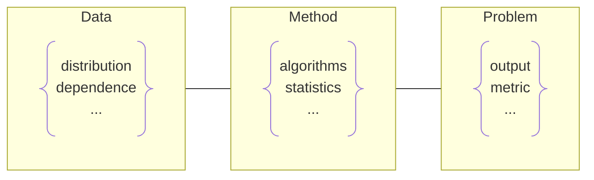
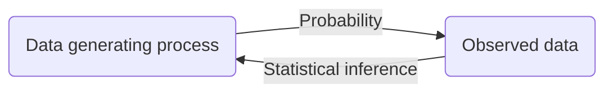

---
{"publish":true,"title":"*Sufficient* of Statistics","created":"2023-10-17T21:41:50","modified":"2025-05-24T19:41:24","cssclasses":""}
---

# *Sufficient* of Statistics

Statistics is a **problem-solving procedure**:

- [c] Table. Statistics dictionary

| Statistics                      | **[[Machine Learning]]**            |
| ------------------------------- | ----------------------------------- |
| estimation                      | [[Machine Learning\|learning]]      |
| [[Regression]]                  | [[Supervised Learning]]             |
| [[Clustering]]                  | [[Unsupervised Learning]]           |
| [[Hypothesis Testing\|hypothesis]] | [[Classification]]                  |
| covariates                      | features                            |
| coefficient                     | weight                              |
| predictor                       | input                               |
| response                        | output                              |
| intercept                       | bias                                |
| derived predictor               | [[Hidden Units]]                    |
| penalty function                | [[L2 Regularization\|weight decay]] |

## Basic Concepts

- [[Statistical Model]]
- [[Statistical Decision Theory]]

- Estimation
    - Concepts
        - [[Likelihood]]
        - [[Confidence Interval]]
    - Methods
        - [[Maximum Likelihood Estimation]]
        - [[Method of Moments]]
        - [[Mean Squared Error]]
- [[Hypothesis Testing]]
- [[Regression]]
- [[Variance]]
    - [[ANOVA]]

## Probability and Statistics

[[Probability Theory]] answers the following question:

> [!qn] Given a data generating process, what are the properties of the outcomes?

While statistical inference answers the inverse problem:

> [!qn] Given the outcomes, what can we say about the process that generated the data?
