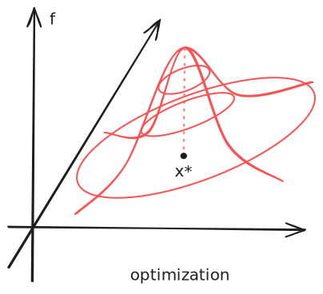
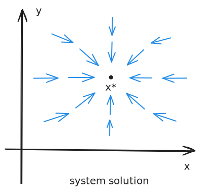

---
{"publish":true,"title":"Z-Estimator","created":"2025-06-06T16:34:37","modified":"2025-06-07T23:10:02","cssclasses":"","state":"[[%wip]]","sup":["[[Estimation]]"],"alias":null,"type":"note"}
---

# Z-Estimator

Recall that an [[M-Estimator]] seeks the minimizer of a function $M_{n}$. Suppose the function is differentiable and convex, its minimizer equals the **zero** of its derivative
$$
\Psi _{n}(\hat{\theta}) = \frac{1}{n} \sum_{i=1}^{n}\psi _{\hat{\theta}}(X_{i}) = 0, \tag{Z}
$$
where in this case, $\psi$ is the derivative of $m$ in the definition of M-estimator.

However, $\psi$ can be more general without necessarily corresponding to an optimization problem. For example, recall that for a [[Method of Moments\|Moment Estimator]], we solve a system
$$
\frac{1}{n}\sum_{i=1}^{n}\psi _{\hat{\theta}}(X_{i})= \frac{1}{n} \sum_{i=1}^{n}\left(  \mathbb{E}_{\hat{\theta}}g - g(X_{i}) \right) = \mathbb{E}_{\hat{\theta}}g - \hat{\mathbb{E}}_{n}g = 0.
$$
Thus, [[Method of Moments\|Moment Estimator]]s are also a special case of Z-estimators.

As we can see, Z-estimators are a class of more general estimators that solve the zero point of a system of ==estimating equations== $(Z)$.

- [c] Table. Comparison of optimization and system solution.

| Optimization                                     | System Solution                            |
| ------------------------------------------------ | ------------------------------------------ |
| M-estimators                                     | Z-estimators                               |
| Optimizing an objective function                 | Solving an equation system                 |
| Utilize optimization landscape, e.g., gradient   | Utilize system dynamics, e.g., contraction |
|  |  |

As we discussed earlier, for convex/concave and differentiable objective functions, optimization is equivalent to solving a system regarding the gradient.
Conversely, we can also define an objective function for solving a system of equations. For example, for a linear system $Ax=b$, we can define the squared cost $f(x) = \|Ax-b\|_{2}^{2}$, whose minimizer is the solution of the system.

However, different problem formulations offer different insights and solution methods.

- Optimization is more suitable if you have a clear and well-motivated objective function;
- System solution is more suitable when you know how the solution determines the system dynamics.
- When optimizing a function, we usually care more about how the local landscape, e.g., gradient, carries the decision variable to the optimum;
- When solving a system, we usually want to follow some system dynamics, e.g., a contractive operator, to reach the solution.

## Properties
