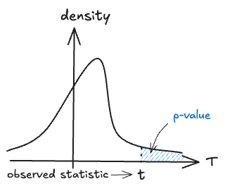
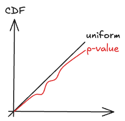

---
{"publish":true,"title":"p-value","created":"2025-05-29T17:32:33","modified":"2025-05-31T22:01:24","cssclasses":""}
---

# p-value

**p-value** is the probability of obtaining a real-valued **test statistic** *at least as* extreme as the one actually obtained under the **null hypothesis**. ^extreme

In other words, (asymptotic) p-value of a test is the smallest (asymptotic) level $\alpha$ at which the test rejects $H_{0}$. ^reject

Consider an observed test-statistic $t$ from unknown distribution $T$. Then the p-value $p$ is what the prior probability would be of observing a test-statistic value at least as "extreme" as $t$ if null hypothesis $H_{0}$ were true. That is:

- $p=\Pr(T≥t|H_0)$ for a one-sided right-tail test,
- $p=\Pr(T≤t|H_0)$ for a one-sided left-tail test,
- $p=2\min\{\Pr(T\geq t\mid H_{0}),\Pr(T\leq t\mid H_{0})$ for a two-sided test.
    - If the distribution of $T$ is symmetric about zero, then $p=\Pr(|T|\geq |t|\mid H_{0})$

> [!ex] [[Hypothesis Testing#CLT Test Statistic]]
>
> $
> p =
> \begin{cases}
> \Pr\left(T_{n}\geq t\right) & \text{(right-tail test)}\\
> \Pr\left(T_{n}\leq t\right) & \text{(left-tail test)}\\
> \Pr\left(\left|T_{n}\right|\geq |t|\right) & \text{(two-sided test)}
> \end{cases}
> $
> where $t$ is the observed test statistic.

- [!] Since the test statistic is random, p-value is also random.

> [!thm] Fundamental rule of statistics
> $\text{Reject } \mathrm{H}_{0} \iff  p\text{-value} < \alpha$

In other words, an almost impossible event ($p<\alpha$) happens given H0, thus it is rejected.

- [~] The smaller the p-value, the more confidently one can reject $H_{0}$, because the event is too unlikely to happen under null.

## Formal Definitions

The above note provides an intuitive understanding of p-value. This section discusses p-value from a more formal perspective.

We first formalize the idea in [[p-value#^reject]] using [[Hypothesis Testing#Test Statistic and Rejection Region\|rejection regions]]. Suppose we are given a test statistic $T$ and its rejection regions $\mathrm{RR}_{\alpha }$ for any level $\alpha$. Then, we have
$$
p\text{-value} = \inf \{ \alpha : T \in \mathrm{RR}_{\alpha } \}. \tag{1}
$$

We then formalize the idea in [[p-value#^extreme]]. For a test statistic $T$, whose randomness depends on the underlying true parameter, we denote $T_{\theta_{0}}$ as the same statistic but whose distribution is determined by the null parameter $\theta_{0}$ and is usually known. Then, suppose the rejection region is of the form $\mathrm{RR}_{\alpha} = \{ T \ge c_{\alpha} \}$, i.e., consider a right-tail test. Then, we have
$$
p\text{-value} = P_{\theta_{0}}(T_{\theta_{0}} \ge T). \tag{2}
$$
Specifically, upon realization of the test statistic $T=t$, the p-value is realized as $P_{\theta_{0}}(T_{\theta_{0}} \ge t)$.

Finally, we provide the most general definition of p-value, which does not depend on the rejection region:
p-value is a [[Statistic]] $p: \mathcal{X} \to [0,1]$ such that
$$
P_{\theta_{0}}(p(X) \le t) \le t, \quad \forall t\in[0,1], \theta_{0}\in\Theta _{0}. \tag{3}
$$
Recall that the CDF of a uniform distribution is $P_{\mathrm{Unif}}(X\le t) = t$ for $t\in[0,1]$. Thus, p-value is also said to has a ==super-uniform== distribution. Common p-values are uniform.

> [!rmk] Understanding the super-uniformality of p-value  
> - p-value is a **tail probability**. Under null, we do not expect the p-value to be very small, because the tail probability of being *too small* is *too small*. See Figure [[p-value#^tail]].
> - p-value, as a random variable, puts the *evidence* for null on a standardized $[0,1]$-scale. In other words, if the null hypothesis is true, we should observe a p-value uniformly distributed on $[0,1]$. See Figure [[p-value#^uniform]]
>  
>   ^tail
>  
>  ^uniform

To verify the validity of the above definitions $(1)$, $(2)$, and $(3)$, one just need to check that the resultant test $\psi(X) = \mathbb{1}(p(X) \le \alpha )$ gives a size at most $\alpha$.

> [!rmk] CI and HT duality
> - Denoting $\psi _{\alpha} = \mathbb{1}\{ p\le \alpha \}$, we see that a p-value summaries the collection of test $\{ \psi _{\alpha } \}_{\alpha\in [0,1]}$ for different levels and a fixed null.
> - Due to the [[Confidence Interval and Hypothesis Test Duality]], we see that a confidence interval summaries the collection of tests $\{ \psi _{\tilde{\theta} } \}_{\tilde{\theta}\in \Theta}$ for different nulls and a fixed level.

## Examples

### CLT Test Statistic

Given a [[Hypothesis Testing#CLT Test Statistic]] $T \overset{ d }{ \to }\mathcal{N}(0,1)$, an asymptotic right-tail p-value is $p(X) = 1-\Phi(T(X))$, i.e., the Gaussian tail bound. The construction is based on the definition $(2)$.

### Likelihood Ratio Test

For a simple-simple HT, given its likelihood ratio $g(x) = f_{1}(x) / f_{0}(x)$, $1 /g$ is a p-value. We verify that $1 /g$ satisfies the definition $(3)$:
$$
P(1 /g(X)\le t) = P(g(X)\ge t^{-1}) \le \frac{\mathbb{E}_{\theta_{0}}[g(X)]}{(t^{-1})^{-1}} = t\int \frac{f_{1}(x)}{f_{0}(x)} f_{0}(x) dx = t,
$$
where the inequality uses [[Chebyshev Inequality\|Markov Inequality]]. See also [[Likelihood Ratio Test]] for more general results.
